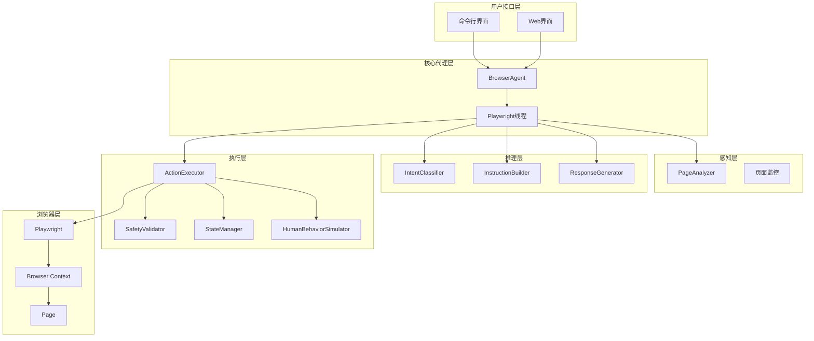

# AI浏览器代理完成项目设计文档

## 概述

本设计文档基于现有的AI浏览器代理项目架构，详细描述了完成项目所需的核心功能实现。项目采用三层架构设计：感知层(Perception Layer)、推理层(Reasoning Layer)和执行层(Action Layer)，通过线程安全的设计实现高效的浏览器自动化。

## 架构设计

### 系统架构图



### 组件和接口

#### 1. 感知层组件

**PageAnalyzer**
- **职责**: 分析网页内容，提取页面结构和语义信息
- **输入**: Playwright Page对象
- **输出**: 页面意图图谱(Page Intent Graph)
- **关键方法**:
  - `analyze()`: 生成完整的页面分析结果
  - `get_aria_snapshot()`: 获取辅助功能快照
  - `_extract_elements_info()`: 提取可交互元素信息
  - `_identify_functional_areas()`: 识别页面功能区域

#### 2. 推理层组件

**IntentClassifier**
- **职责**: 分析用户自然语言输入，识别用户意图
- **输入**: 用户自然语言文本
- **输出**: 意图分类结果和置信度
- **支持的意图类型**:
  - NAVIGATION: 导航操作
  - INTERACTION: 页面交互
  - INFORMATION_EXTRACTION: 信息提取
  - SUMMARY_INFO: 摘要信息
  - DETAILED_INFO: 详细信息
  - STRUCTURED_DATA: 结构化数据
  - FULL_PAGE_CONTENT: 完整页面内容

**InstructionBuilder**
- **职责**: 将用户意图转换为标准化的JSON指令
- **输入**: 用户文本、页面数据、会话状态
- **输出**: 规范化的JSON格式指令
- **关键特性**:
  - 支持单步和多步指令生成
  - 集成LLM进行智能指令构建
  - 启发式规则优化性能

**ResponseGenerator**
- **职责**: 根据执行结果和用户意图生成自然语言响应
- **输入**: 提取的内容、意图结果、响应上下文
- **输出**: 格式化的用户友好响应

#### 3. 执行层组件

**ActionExecutor**
- **职责**: 安全执行标准化指令，与浏览器交互
- **支持的操作类型**:
  - 基础操作: navigate, click, fill, select, wait
  - 高级操作: screenshot, extract, scroll, key
  - 智能操作: smart_fill, smart_submit, extract_results
  - 文件操作: save_as_pdf, save_as_mhtml
- **安全特性**:
  - 指令模板化执行
  - 输入验证和转义
  - 操作权限限制

**SafetyValidator**
- **职责**: 验证和清理执行指令，确保安全性
- **验证规则**:
  - 指令格式验证
  - 参数类型检查
  - 恶意内容过滤
  - 选择器安全性验证

**StateManager**
- **职责**: 管理浏览器会话和程序状态
- **状态类型**:
  - 浏览器会话状态(cookies, localStorage)
  - 程序执行状态(变量, 上下文)
  - 对话历史状态

**HumanBehaviorSimulator**
- **职责**: 模拟真实用户行为，避免检测
- **模拟特性**:
  - 操作间隔延迟
  - 随机暂停
  - 自然鼠标移动
  - 人类化打字速度
  - 页面加载等待

## 数据模型

### 页面意图图谱 (Page Intent Graph)

```json
{
  "is_valid": true,
  "url": "https://example.com",
  "title": "示例页面",
  "elements": [
    {
      "type": "button",
      "text": "登录",
      "attributes": {"id": "login-btn", "class": "btn primary"},
      "position": {"x": 100, "y": 200, "width": 80, "height": 32},
      "selector": "#login-btn",
      "isInteractive": true
    }
  ],
  "text_content": "页面主要文本内容...",
  "functional_areas": [
    {"type": "search_box", "selector": "input[type='text']"},
    {"type": "navigation_bar", "selector": "nav"}
  ],
  "page_type": "generic",
  "aria_snapshot": {...}
}
```

### JSON指令格式

```json
{
  "action": "click",
  "selector": "#login-btn",
  "value": null,
  "options": {
    "timeout": 5000,
    "force": false
  },
  "description": "点击登录按钮"
}
```

### 多步指令格式

```json
{
  "steps": [
    {
      "action": "navigate",
      "value": "https://example.com",
      "description": "导航到示例网站"
    },
    {
      "action": "fill",
      "selector": "#username",
      "value": "user123",
      "description": "输入用户名"
    },
    {
      "action": "click",
      "selector": "#login-btn",
      "description": "点击登录按钮"
    }
  ],
  "description": "执行登录流程"
}
```

## 错误处理

### 错误处理策略

1. **分层错误处理**
   - 执行层: 捕获Playwright异常和操作失败
   - 推理层: 处理LLM调用失败和指令构建错误
   - 感知层: 处理页面分析异常

2. **错误恢复机制**
   - 自动重试机制
   - 备选选择器尝试
   - 降级执行策略
   - 用户友好的错误提示

3. **错误日志记录**
   - 详细的错误堆栈信息
   - 操作上下文记录
   - 性能指标收集

### 错误类型定义

```python
class BrowserAgentError(Exception):
    """浏览器代理基础异常"""
    pass

class InstructionValidationError(BrowserAgentError):
    """指令验证异常"""
    pass

class PageAnalysisError(BrowserAgentError):
    """页面分析异常"""
    pass

class ExecutionTimeoutError(BrowserAgentError):
    """执行超时异常"""
    pass
```

## 测试策略

### 单元测试

1. **感知层测试**
   - 页面分析功能测试
   - 元素提取准确性测试
   - 异常处理测试

2. **推理层测试**
   - 意图分类准确性测试
   - 指令构建逻辑测试
   - LLM集成测试

3. **执行层测试**
   - 各种操作类型测试
   - 安全验证测试
   - 人类行为模拟测试

### 集成测试

1. **端到端工作流测试**
   - 完整的用户指令执行流程
   - 多步操作序列测试
   - 错误恢复流程测试

2. **浏览器兼容性测试**
   - Chromium, Firefox, Safari支持
   - 不同网站的兼容性测试
   - 动态内容处理测试

### 性能测试

1. **响应时间测试**
   - 指令处理延迟
   - 页面分析性能
   - LLM调用时间

2. **资源使用测试**
   - 内存使用监控
   - CPU使用率测试
   - 浏览器资源管理

## 安全设计

### 代码执行安全

1. **模板化执行**
   - 预定义的安全操作模板
   - 禁止直接执行LLM生成的代码
   - 参数化查询防止注入

2. **输入验证**
   - 严格的参数类型检查
   - 恶意内容过滤
   - 选择器安全性验证

3. **权限控制**
   - 限制文件系统访问
   - 网络请求白名单
   - 系统命令执行限制

### 数据安全

1. **敏感信息处理**
   - 密码等敏感数据不记录日志
   - 会话数据加密存储
   - 自动清理临时数据

2. **会话隔离**
   - 用户会话相互隔离
   - 浏览器上下文独立管理
   - 状态数据安全存储

## 性能优化

### 执行性能优化

1. **智能缓存**
   - 页面分析结果缓存
   - LLM响应缓存
   - 选择器有效性缓存

2. **并发处理**
   - 异步操作支持
   - 多线程安全设计
   - 资源池管理

3. **启发式优化**
   - 常见操作模式识别
   - 快速路径执行
   - 预测性加载

### 资源管理

1. **内存管理**
   - 及时释放不用的资源
   - 大对象的生命周期管理
   - 垃圾回收优化

2. **浏览器资源**
   - 页面生命周期管理
   - 标签页数量控制
   - 缓存策略优化

## 扩展性设计

### 插件系统

1. **插件接口定义**
   ```python
   class BrowserPlugin:
       def on_before_action(self, action, context):
           pass
       
       def on_after_action(self, result, context):
           pass
       
       def provide_custom_actions(self):
           return []
   ```

2. **插件管理**
   - 动态插件加载
   - 插件生命周期管理
   - 插件间依赖处理

### 自定义操作

1. **操作扩展机制**
   - 自定义操作注册
   - 操作模板定义
   - 参数验证规则

2. **网站特定优化**
   - 网站特定的选择器策略
   - 专门的内容提取规则
   - 反检测机制

## 部署架构

### 开发环境

1. **本地开发**
   - 单机部署配置
   - 开发工具集成
   - 调试支持

2. **依赖管理**
   - Poetry项目管理
   - 虚拟环境隔离
   - 依赖版本锁定

### 生产环境

1. **容器化部署**
   - Docker镜像构建
   - 多阶段构建优化
   - 健康检查配置

2. **服务监控**
   - 性能指标收集
   - 错误率监控
   - 资源使用追踪

## 配置管理

### 环境配置

```python
# 核心配置项
BROWSER_TYPE = "chromium"  # 浏览器类型
HEADLESS = False          # 是否无头模式
USER_DATA_DIR = "./browser_data"  # 用户数据目录

# LLM配置
LLM_PROVIDER = "gemini"   # LLM提供商
GEMINI_API_KEY = ""       # API密钥
GEMINI_MODEL = "gemini-1.5-flash"  # 模型名称

# 行为模拟配置
HUMAN_BEHAVIOR_ENABLED = True     # 启用人类行为模拟
HUMAN_BEHAVIOR_MODE = "moderate"  # 模拟强度
```

### 运行时配置

1. **动态配置调整**
   - 运行时参数修改
   - 配置热重载
   - 环境变量覆盖

2. **配置验证**
   - 配置项完整性检查
   - 类型验证
   - 依赖关系验证

## 监控和日志

### 日志系统

1. **分层日志**
   - 应用层日志
   - 组件层日志
   - 调试日志

2. **日志格式**
   - 结构化日志输出
   - 时间戳和级别标记
   - 上下文信息包含

### 性能监控

1. **关键指标**
   - 指令执行时间
   - 页面加载时间
   - 内存使用情况
   - 错误率统计

2. **监控告警**
   - 性能阈值告警
   - 错误率异常告警
   - 资源使用告警

## 总结

本设计文档详细描述了AI浏览器代理项目的完整技术架构和实现方案。通过分层设计、安全机制、性能优化和扩展性考虑，系统能够实现高鲁棒性、多轮对话支持、高安全性和可审计性的目标。设计充分考虑了现有代码基础，确保实现方案的可行性和一致性。