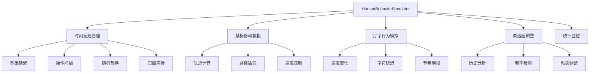
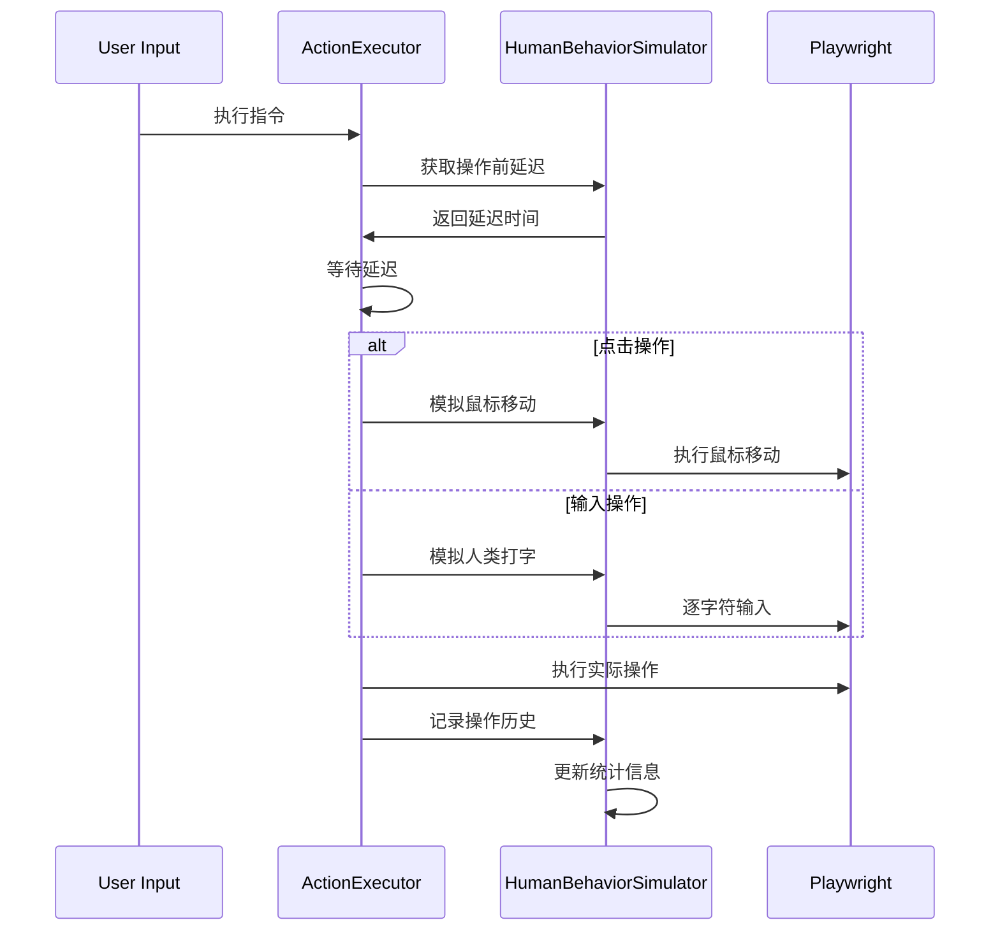

# 人类行为模拟功能

## 概述

AI浏览器智能体的人类行为模拟功能旨在模拟真实用户的操作行为，避免触发网站的反爬虫机制、人机验证或其他反自动化检测。通过智能化的时间延迟、鼠标移动轨迹、打字模式等技术，使自动化操作更加自然和人性化。

## 核心特性

### 🎭 行为模式

支持三种预定义的行为模式：

- **保守模式 (Conservative)**: 较长的延迟和更谨慎的操作节奏，适合高安全性网站
- **适中模式 (Moderate)**: 平衡的延迟设置，适合大多数场景（默认推荐）
- **激进模式 (Aggressive)**: 较短的延迟，适合内部测试或对检测不敏感的环境

### ⏱️ 智能时间控制

- **基础延迟**: 每个操作前的随机延迟
- **操作间隔**: 操作之间的智能间隔调整
- **随机暂停**: 模拟用户思考时间的随机长暂停
- **页面等待**: 导航后的自然页面加载等待
- **自适应调整**: 根据操作历史自动调整时间间隔

### ⌨️ 人类打字模拟

- **变速打字**: 模拟真实的打字速度变化
- **字符特殊性**: 不同字符类型的延迟调整（标点、大写等）
- **自然节奏**: 添加自然的打字节奏变化

### 🖱️ 鼠标移动模拟

- **贝塞尔曲线**: 使用贝塞尔曲线生成自然的鼠标移动轨迹
- **随机偏移**: 添加路径随机性模拟真实移动
- **分步移动**: 平滑的多步骤移动过程

## 架构设计

### 核心组件



### 集成流程



## 配置选项

### 基础配置

```python
behavior_config = {
    # 基础开关
    "enabled": True,
    "behavior_mode": "moderate",  # conservative, moderate, aggressive
    
    # 时间延迟 (秒)
    "base_delay_min": 0.3,
    "base_delay_max": 1.2,
    "action_interval_min": 0.5,
    "action_interval_max": 3.0,
    
    # 打字配置 (字符/秒)
    "typing_speed_min": 3,
    "typing_speed_max": 8,
    
    # 鼠标移动
    "mouse_move_enabled": True,
    "mouse_move_steps": 20,
    "mouse_move_duration": 0.8,
    
    # 随机暂停
    "random_pause_probability": 0.15,
    "random_pause_min": 2.0,
    "random_pause_max": 8.0,
    
    # 高级选项
    "adaptive_timing": True,
    "jitter_enabled": True,
}
```

### 环境变量配置

通过 `.env` 文件配置：

```bash
# 启用人类行为模拟
HUMAN_BEHAVIOR_ENABLED=true
HUMAN_BEHAVIOR_MODE=moderate

# 延迟配置
HUMAN_BASE_DELAY_MIN=0.3
HUMAN_BASE_DELAY_MAX=1.2
HUMAN_ACTION_INTERVAL_MIN=0.5
HUMAN_ACTION_INTERVAL_MAX=3.0

# 其他配置...
```

## 使用指南

### 基础使用

```python
from src.action.executor import ActionExecutor
from src.common.config import get_human_behavior_config

# 使用默认配置
behavior_config = get_human_behavior_config()
executor = ActionExecutor(page, behavior_config=behavior_config)

# 执行操作（自动应用人类行为模拟）
result = executor.execute(instruction, session_state)
```

### 自定义配置

```python
# 自定义行为配置
custom_config = {
    "behavior_mode": "conservative",
    "base_delay_min": 1.0,
    "base_delay_max": 2.5,
    "random_pause_probability": 0.25
}

executor = ActionExecutor(page, behavior_config=custom_config)
```

### 动态配置调整

```python
# 运行时调整配置
executor.configure_behavior({
    "behavior_mode": "aggressive",
    "typing_speed_min": 8,
    "typing_speed_max": 15
})

# 获取行为统计
stats = executor.get_behavior_stats()
print(f"总操作数: {stats['total_actions']}")
print(f"成功率: {stats['success_rate']:.1%}")
```

## 最佳实践

### 场景选择

#### 🏦 高安全性网站 (银行、支付)
```python
config = {
    "behavior_mode": "conservative",
    "base_delay_min": 1.0,
    "base_delay_max": 3.0,
    "action_interval_min": 2.0,
    "action_interval_max": 6.0,
    "random_pause_probability": 0.3,
    "typing_speed_min": 2,
    "typing_speed_max": 5
}
```

#### 📱 社交媒体网站
```python
config = {
    "behavior_mode": "moderate",
    "base_delay_min": 0.5,
    "base_delay_max": 1.5,
    "action_interval_min": 1.0,
    "action_interval_max": 4.0,
    "random_pause_probability": 0.2
}
```

#### 🧪 内部测试环境
```python
config = {
    "behavior_mode": "aggressive",
    "base_delay_min": 0.1,
    "base_delay_max": 0.5,
    "action_interval_min": 0.2,
    "action_interval_max": 1.0,
    "random_pause_probability": 0.05
}
```

### 监控和调优

```python
# 定期检查行为统计
stats = executor.get_behavior_stats()

# 如果检测到异常（如成功率下降）
if stats['success_rate'] < 0.8:
    # 切换到更保守的模式
    executor.configure_behavior({"behavior_mode": "conservative"})
    
# 如果操作过于缓慢
if stats['average_interval'] > 5.0:
    # 调整到更激进的设置
    executor.configure_behavior({
        "action_interval_min": 0.5,
        "action_interval_max": 2.0
    })
```

## 技术实现细节

### 时间延迟算法

```python
def get_action_interval(self, action_type: str) -> float:
    # 基础间隔
    base_min = self.config["action_interval_min"]
    base_max = self.config["action_interval_max"]
    
    # 操作类型调整
    multipliers = {
        "navigate": 1.5,  # 导航需要更长等待
        "click": 1.0,
        "fill": 1.2,      # 输入稍微慢一点
        "scroll": 0.8,    # 滚动可以快一点
    }
    
    multiplier = multipliers.get(action_type, 1.0)
    interval = random.uniform(base_min * multiplier, base_max * multiplier)
    
    # 自适应调整
    if self.config["adaptive_timing"]:
        interval = self._apply_adaptive_timing(interval, action_type)
        
    return interval
```

### 鼠标移动轨迹

```python
def simulate_mouse_movement(self, page, start_pos, end_pos):
    # 生成贝塞尔曲线控制点
    control1 = (start_x + random_offset, start_y + random_offset)
    control2 = (end_x + random_offset, end_y + random_offset)
    
    # 分步插值移动
    for i in range(steps):
        t = i / steps
        # 三次贝塞尔曲线插值
        pos = cubic_bezier(start_pos, control1, control2, end_pos, t)
        page.mouse.move(pos.x, pos.y)
        time.sleep(duration / steps)
```

### 自适应时间调整

```python
def _apply_adaptive_timing(self, base_interval, action_type):
    # 分析最近操作频率
    recent_actions = self.action_history[-5:]
    if len(recent_actions) >= 2:
        intervals = []
        for i in range(1, len(recent_actions)):
            diff = recent_actions[i]["timestamp"] - recent_actions[i-1]["timestamp"]
            intervals.append(diff)
            
        avg_interval = sum(intervals) / len(intervals)
        
        # 如果操作过于频繁，增加延迟
        if avg_interval < 2.0:
            base_interval *= 1.3
        elif avg_interval > 8.0:
            base_interval *= 0.8
            
    return base_interval
```

## 测试验证

### 单元测试

运行人类行为模拟的单元测试：

```bash
python -m pytest tests/unit/test_human_behavior_simulator.py -v
python -m pytest tests/unit/test_action_executor_behavior.py -v
```

### 功能演示

运行完整的功能演示：

```bash
python examples/human_behavior_demo.py
```

### 性能基准

```python
# 比较不同模式的执行时间
modes = ["disabled", "aggressive", "moderate", "conservative"]
for mode in modes:
    start_time = time.time()
    # 执行标准测试序列
    end_time = time.time()
    print(f"{mode}: {end_time - start_time:.2f}s")
```

## 故障排除

### 常见问题

#### 1. 操作过慢
**症状**: 自动化执行速度明显下降  
**解决**: 调整为激进模式或减少延迟参数

```python
executor.configure_behavior({
    "behavior_mode": "aggressive",
    "base_delay_min": 0.1,
    "action_interval_min": 0.2
})
```

#### 2. 仍被检测为机器人
**症状**: 网站显示人机验证或阻止访问  
**解决**: 增加随机性和延迟

```python
executor.configure_behavior({
    "behavior_mode": "conservative",
    "random_pause_probability": 0.3,
    "jitter_enabled": True
})
```

#### 3. 鼠标移动失败
**症状**: 鼠标移动模拟出现错误  
**解决**: 禁用鼠标移动或调整参数

```python
executor.configure_behavior({
    "mouse_move_enabled": False
})
# 或者
executor.configure_behavior({
    "mouse_move_steps": 10,
    "mouse_move_duration": 0.5
})
```

### 调试技巧

#### 启用详细日志
```python
import logging
logging.getLogger('src.action.human_behavior_simulator').setLevel(logging.DEBUG)
```

#### 监控统计信息
```python
# 定期输出统计
stats = executor.get_behavior_stats()
logger.info(f"行为统计: {stats}")
```

#### 分析操作历史
```python
# 查看最近的操作记录
history = executor.behavior_simulator.action_history[-10:]
for record in history:
    print(f"{record['action_type']}: {record['success']} ({record['execution_time']:.2f}s)")
```

## 贡献指南

### 添加新的行为模式

1. 在 `HumanBehaviorSimulator._apply_behavior_mode()` 中添加新模式
2. 更新配置文档和示例
3. 添加相应的测试用例

### 扩展行为特性

1. 在 `HumanBehaviorSimulator` 类中实现新功能
2. 在 `ActionExecutor` 中集成新功能
3. 添加配置选项和测试

### 性能优化

1. 分析瓶颈点（通常在延迟计算和随机数生成）
2. 优化算法实现
3. 添加性能基准测试

## 更新日志

### v1.0.0 (当前版本)
- ✅ 基础人类行为模拟功能
- ✅ 三种预定义行为模式
- ✅ 智能时间延迟管理
- ✅ 鼠标移动轨迹模拟
- ✅ 人类打字行为模拟
- ✅ 自适应时间调整
- ✅ 统计监控和配置管理
- ✅ 全面的单元测试覆盖

### 计划中的功能
- 🔄 机器学习驱动的行为模式
- 🔄 网站特定的行为配置文件
- 🔄 实时检测响应调整
- 🔄 更复杂的鼠标行为模拟
- 🔄 键盘组合键模拟

## 许可证

本功能遵循项目主许可证。请确保在使用时遵守目标网站的服务条款和相关法律法规。