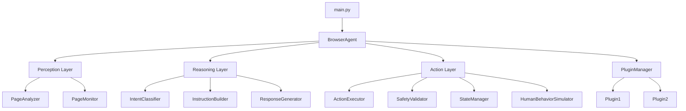
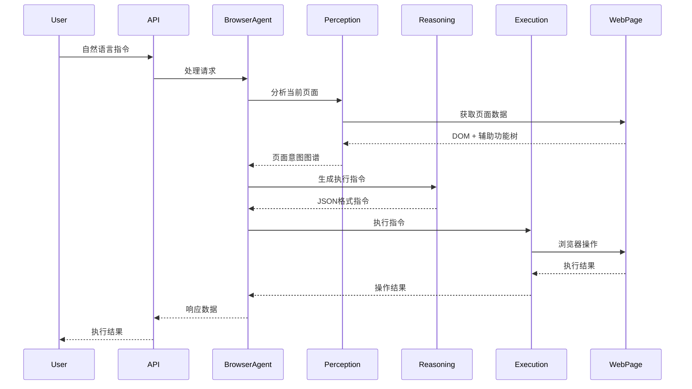

# AI浏览器代理开发者指南

## 概述

本文档为AI浏览器代理项目的开发者提供完整的开发指南，包括环境设置、代码结构、开发流程、测试策略和贡献指南。

## 目录

- [快速开始](#快速开始)
- [开发环境设置](#开发环境设置)
- [项目架构](#项目架构)
- [开发流程](#开发流程)
- [代码规范](#代码规范)
- [测试指南](#测试指南)
- [调试技巧](#调试技巧)
- [性能优化](#性能优化)
- [插件开发](#插件开发)
- [贡献指南](#贡献指南)

## 快速开始

### 前置要求

- Python 3.9+
- Node.js 16+ (用于前端开发)
- Git
- 支持的操作系统：Windows, macOS, Linux

### 一键设置

```bash
# 克隆仓库
git clone https://github.com/cyneck/ai-browser-agent.git
cd ai-browser-agent

# 运行设置脚本
./scripts/setup.sh  # Linux/macOS
# 或
scripts\setup.bat   # Windows

# 启动开发服务器
python -m src.main --dev
```

## 开发环境设置

### 1. Python环境

```bash
# 创建虚拟环境
python -m venv .venv

# 激活虚拟环境
source .venv/bin/activate  # Linux/macOS
# 或
.venv\Scripts\activate     # Windows

# 安装依赖
pip install -e ".[dev]"
```

### 2. Poetry环境（推荐）

```bash
# 安装Poetry
curl -sSL https://install.python-poetry.org | python3 -

# 安装依赖
poetry install --with dev

# 激活环境
poetry shell
```

### 3. 浏览器设置

```bash
# 安装Playwright浏览器
playwright install

# 验证安装
playwright --version
```

### 4. 环境变量配置

```bash
# 复制环境变量模板
cp .env.example .env

# 编辑环境变量
# 必需配置：
# - GEMINI_API_KEY: Google Gemini API密钥
# - OPENAI_API_KEY: OpenAI API密钥（可选）
# - DEBUG_MODE: 开发模式（true/false）
```

### 5. 开发工具设置

#### VS Code配置

```json
// .vscode/settings.json
{
    "python.defaultInterpreterPath": "./.venv/bin/python",
    "python.linting.enabled": true,
    "python.linting.pylintEnabled": true,
    "python.formatting.provider": "black",
    "python.sortImports.args": ["--profile", "black"],
    "editor.formatOnSave": true,
    "editor.codeActionsOnSave": {
        "source.organizeImports": true
    }
}
```

#### Pre-commit钩子

```bash
# 安装pre-commit
pip install pre-commit

# 安装钩子
pre-commit install

# 手动运行检查
pre-commit run --all-files
```

## 项目架构

### 核心架构

```
AI浏览器代理采用三层架构：

┌─────────────────┐
│   用户接口层     │  CLI, Web UI, REST API
├─────────────────┤
│   业务逻辑层     │  BrowserAgent, SessionManager
├─────────────────┤
│   核心功能层     │  感知层, 推理层, 执行层
├─────────────────┤
│   基础设施层     │  Playwright, 插件系统, 配置管理
└─────────────────┘
```

### 模块依赖关系



### 数据流



## 开发流程

### 1. 功能开发流程

```bash
# 1. 创建功能分支
git checkout -b feature/new-feature

# 2. 开发功能
# - 编写代码
# - 添加测试
# - 更新文档

# 3. 运行测试
pytest tests/

# 4. 代码检查
black src/ tests/
isort src/ tests/
mypy src/

# 5. 提交代码
git add .
git commit -m "feat: add new feature"

# 6. 推送分支
git push origin feature/new-feature

# 7. 创建Pull Request
```

### 2. Bug修复流程

```bash
# 1. 创建修复分支
git checkout -b fix/bug-description

# 2. 重现问题
# - 编写失败测试
# - 确认问题存在

# 3. 修复问题
# - 修改代码
# - 确保测试通过

# 4. 验证修复
pytest tests/
python -m src.main --test-mode

# 5. 提交修复
git commit -m "fix: resolve bug description"
```

### 3. 发布流程

```bash
# 1. 更新版本号
# 编辑 pyproject.toml 中的版本号

# 2. 更新变更日志
# 编辑 CHANGELOG.md

# 3. 创建发布标签
git tag -a v1.0.0 -m "Release version 1.0.0"

# 4. 推送标签
git push origin v1.0.0

# 5. 构建发布包
poetry build

# 6. 发布到PyPI
poetry publish
```

## 代码规范

### 1. Python代码规范

#### 命名约定

```python
# 类名：PascalCase
class BrowserAgent:
    pass

# 函数名：snake_case
def execute_instruction():
    pass

# 常量：UPPER_SNAKE_CASE
MAX_RETRY_COUNT = 3

# 私有方法：前缀下划线
def _internal_method():
    pass
```

#### 类型注解

```python
from typing import Dict, List, Optional, Union

def process_instruction(
    text: str,
    session_id: Optional[str] = None,
    timeout: int = 30
) -> Dict[str, Union[str, bool]]:
    """处理用户指令
    
    Args:
        text: 用户输入的自然语言指令
        session_id: 会话ID，可选
        timeout: 超时时间，默认30秒
        
    Returns:
        包含执行结果的字典
        
    Raises:
        ValidationError: 当输入验证失败时
        ExecutionError: 当执行失败时
    """
    pass
```

#### 错误处理

```python
# 自定义异常
class BrowserAgentError(Exception):
    """浏览器代理基础异常"""
    pass

class ValidationError(BrowserAgentError):
    """输入验证异常"""
    pass

# 异常处理
try:
    result = execute_instruction(text)
except ValidationError as e:
    logger.error(f"输入验证失败: {e}")
    raise
except Exception as e:
    logger.exception(f"未预期的错误: {e}")
    raise BrowserAgentError(f"执行失败: {e}") from e
```

### 2. 文档规范

#### 模块文档

```python
"""
AI浏览器代理感知层模块

本模块负责网页内容的解析和理解，包括：
- DOM结构分析
- 辅助功能树提取
- 页面意图识别
- 动态内容监控

作者: AI Browser Agent Team
版本: 1.0.0
"""
```

#### 函数文档

```python
def analyze_page(page: Page) -> PageIntentGraph:
    """分析网页内容并生成页面意图图谱
    
    该函数接收Playwright Page对象，分析页面的DOM结构、
    辅助功能树和可交互元素，生成结构化的页面意图图谱。
    
    Args:
        page: Playwright Page对象，表示当前网页
        
    Returns:
        PageIntentGraph: 包含页面结构和交互元素的意图图谱
        
    Raises:
        PageAnalysisError: 当页面分析失败时
        
    Example:
        >>> from playwright.sync_api import sync_playwright
        >>> with sync_playwright() as p:
        ...     browser = p.chromium.launch()
        ...     page = browser.new_page()
        ...     page.goto("https://example.com")
        ...     graph = analyze_page(page)
        ...     print(graph.elements)
    """
    pass
```

### 3. 配置管理

```python
# config.py
from pydantic import BaseSettings

class Settings(BaseSettings):
    """应用配置"""
    
    # API配置
    gemini_api_key: str
    openai_api_key: Optional[str] = None
    
    # 浏览器配置
    browser_type: str = "chromium"
    headless: bool = False
    user_data_dir: str = "./browser_data"
    
    # 行为模拟配置
    human_behavior_enabled: bool = True
    human_behavior_mode: str = "moderate"
    
    # 调试配置
    debug_mode: bool = False
    log_level: str = "INFO"
    
    class Config:
        env_file = ".env"
        env_file_encoding = "utf-8"

# 使用配置
settings = Settings()
```

## 测试指南

### 1. 测试结构

```
tests/
├── unit/                   # 单元测试
│   ├── test_perception.py  # 感知层测试
│   ├── test_reasoning.py   # 推理层测试
│   └── test_action.py      # 执行层测试
├── integration/            # 集成测试
│   ├── test_workflow.py    # 工作流测试
│   └── test_api.py         # API测试
├── e2e/                    # 端到端测试
│   └── test_scenarios.py   # 场景测试
└── fixtures/               # 测试数据
    ├── sample_pages/       # 样例网页
    └── test_data.json      # 测试数据
```

### 2. 单元测试示例

```python
import pytest
from unittest.mock import Mock, patch
from src.perception.page_analyzer import PageAnalyzer

class TestPageAnalyzer:
    """PageAnalyzer单元测试"""
    
    @pytest.fixture
    def analyzer(self):
        """创建PageAnalyzer实例"""
        return PageAnalyzer()
    
    @pytest.fixture
    def mock_page(self):
        """创建模拟Page对象"""
        page = Mock()
        page.url = "https://example.com"
        page.title.return_value = "Example Page"
        return page
    
    def test_analyze_page_success(self, analyzer, mock_page):
        """测试页面分析成功情况"""
        # 设置模拟数据
        mock_page.content.return_value = "<html><body><h1>Test</h1></body></html>"
        
        # 执行测试
        result = analyzer.analyze(mock_page)
        
        # 验证结果
        assert result.is_valid is True
        assert result.url == "https://example.com"
        assert len(result.elements) > 0
    
    def test_analyze_page_failure(self, analyzer, mock_page):
        """测试页面分析失败情况"""
        # 设置异常
        mock_page.content.side_effect = Exception("Network error")
        
        # 执行测试并验证异常
        with pytest.raises(PageAnalysisError):
            analyzer.analyze(mock_page)
```

### 3. 集成测试示例

```python
import pytest
from src.main import BrowserAgent

class TestBrowserAgentIntegration:
    """BrowserAgent集成测试"""
    
    @pytest.fixture
    async def agent(self):
        """创建BrowserAgent实例"""
        agent = BrowserAgent()
        await agent.start()
        yield agent
        await agent.stop()
    
    @pytest.mark.asyncio
    async def test_full_workflow(self, agent):
        """测试完整工作流"""
        # 执行指令
        result = await agent.execute("打开百度")
        
        # 验证结果
        assert result.success is True
        assert "百度" in result.message
        
        # 执行后续指令
        result = await agent.execute("搜索天气")
        assert result.success is True
```

### 4. 端到端测试

```python
import pytest
from playwright.async_api import async_playwright

class TestE2EScenarios:
    """端到端场景测试"""
    
    @pytest.mark.e2e
    async def test_search_scenario(self):
        """测试搜索场景"""
        async with async_playwright() as p:
            browser = await p.chromium.launch()
            page = await browser.new_page()
            
            # 模拟用户操作
            await page.goto("https://baidu.com")
            await page.fill("#kw", "天气")
            await page.click("#su")
            
            # 验证结果
            await page.wait_for_selector(".result")
            results = await page.query_selector_all(".result")
            assert len(results) > 0
            
            await browser.close()
```

### 5. 测试运行

```bash
# 运行所有测试
pytest

# 运行特定测试
pytest tests/unit/test_perception.py

# 运行集成测试
pytest tests/integration/

# 运行端到端测试
pytest -m e2e

# 生成覆盖率报告
pytest --cov=src --cov-report=html

# 并行运行测试
pytest -n auto
```

## 调试技巧

### 1. 日志调试

```python
import logging

# 配置日志
logging.basicConfig(
    level=logging.DEBUG,
    format='%(asctime)s - %(name)s - %(levelname)s - %(message)s'
)

logger = logging.getLogger(__name__)

# 使用日志
logger.debug("开始分析页面")
logger.info(f"页面URL: {page.url}")
logger.warning("检测到动态内容")
logger.error("页面分析失败", exc_info=True)
```

### 2. 断点调试

```python
import pdb

def analyze_page(page):
    # 设置断点
    pdb.set_trace()
    
    # 或使用breakpoint()（Python 3.7+）
    breakpoint()
    
    result = process_page(page)
    return result
```

### 3. 浏览器调试

```python
# 启用浏览器开发者工具
browser = playwright.chromium.launch(
    headless=False,
    devtools=True
)

# 保存页面截图
await page.screenshot(path="debug.png")

# 保存页面HTML
content = await page.content()
with open("debug.html", "w") as f:
    f.write(content)

# 保存页面MHTML
await page.save_as_mhtml("debug.mhtml")
```

### 4. 性能分析

```python
import cProfile
import pstats

# 性能分析
profiler = cProfile.Profile()
profiler.enable()

# 执行代码
result = execute_instruction(text)

profiler.disable()

# 分析结果
stats = pstats.Stats(profiler)
stats.sort_stats('cumulative')
stats.print_stats(10)
```

## 性能优化

### 1. 代码优化

```python
# 使用缓存
from functools import lru_cache

@lru_cache(maxsize=128)
def get_selector_strategy(element_type: str) -> str:
    """缓存选择器策略"""
    return calculate_strategy(element_type)

# 异步处理
import asyncio

async def process_multiple_pages(pages):
    """并行处理多个页面"""
    tasks = [analyze_page(page) for page in pages]
    results = await asyncio.gather(*tasks)
    return results
```

### 2. 内存优化

```python
# 及时释放资源
class PageAnalyzer:
    def __init__(self):
        self._cache = {}
    
    def analyze(self, page):
        try:
            result = self._do_analyze(page)
            return result
        finally:
            # 清理缓存
            self._cache.clear()
```

### 3. 浏览器优化

```python
# 优化浏览器启动参数
browser = await playwright.chromium.launch(
    args=[
        '--no-sandbox',
        '--disable-dev-shm-usage',
        '--disable-gpu',
        '--disable-extensions',
        '--disable-background-timer-throttling',
        '--disable-backgrounding-occluded-windows',
        '--disable-renderer-backgrounding'
    ]
)
```

## 插件开发

### 1. 插件接口

```python
from abc import ABC, abstractmethod
from typing import Dict, Any, List

class BrowserPlugin(ABC):
    """浏览器插件基类"""
    
    @property
    @abstractmethod
    def name(self) -> str:
        """插件名称"""
        pass
    
    @property
    @abstractmethod
    def version(self) -> str:
        """插件版本"""
        pass
    
    @abstractmethod
    def is_applicable(self, url: str) -> bool:
        """判断插件是否适用于当前URL"""
        pass
    
    @abstractmethod
    def enhance_page_analysis(self, page_data: Dict[str, Any]) -> Dict[str, Any]:
        """增强页面分析"""
        pass
    
    @abstractmethod
    def optimize_instruction(self, instruction: Dict[str, Any]) -> Dict[str, Any]:
        """优化执行指令"""
        pass
```

### 2. 插件实现示例

```python
class BaiduSearchPlugin(BrowserPlugin):
    """百度搜索优化插件"""
    
    @property
    def name(self) -> str:
        return "baidu_search_plugin"
    
    @property
    def version(self) -> str:
        return "1.0.0"
    
    def is_applicable(self, url: str) -> bool:
        return "baidu.com" in url
    
    def enhance_page_analysis(self, page_data: Dict[str, Any]) -> Dict[str, Any]:
        """增强百度页面分析"""
        if self._is_search_page(page_data):
            page_data["page_type"] = "search_results"
            page_data["search_results"] = self._extract_search_results(page_data)
        
        return page_data
    
    def optimize_instruction(self, instruction: Dict[str, Any]) -> Dict[str, Any]:
        """优化百度搜索指令"""
        if instruction.get("action") == "search":
            # 使用百度特定的搜索框选择器
            instruction["selector"] = "#kw"
            instruction["submit_selector"] = "#su"
        
        return instruction
    
    def _is_search_page(self, page_data: Dict[str, Any]) -> bool:
        """判断是否为搜索结果页"""
        return "results" in page_data.get("url", "")
    
    def _extract_search_results(self, page_data: Dict[str, Any]) -> List[Dict[str, Any]]:
        """提取搜索结果"""
        # 实现搜索结果提取逻辑
        pass
```

### 3. 插件注册

```python
# plugins/__init__.py
from .baidu_plugin import BaiduSearchPlugin
from .google_plugin import GoogleSearchPlugin

# 注册插件
AVAILABLE_PLUGINS = [
    BaiduSearchPlugin,
    GoogleSearchPlugin,
]
```

## 贡献指南

### 1. 贡献类型

- **Bug报告**: 发现并报告问题
- **功能请求**: 提出新功能建议
- **代码贡献**: 提交代码修复或新功能
- **文档改进**: 改进项目文档
- **测试用例**: 添加或改进测试

### 2. 贡献流程

1. **Fork仓库**
   ```bash
   # 在GitHub上Fork仓库
   # 克隆你的Fork
   git clone https://github.com/yourusername/ai-browser-agent.git
   ```

2. **设置开发环境**
   ```bash
   cd ai-browser-agent
   poetry install --with dev
   pre-commit install
   ```

3. **创建功能分支**
   ```bash
   git checkout -b feature/your-feature-name
   ```

4. **开发和测试**
   ```bash
   # 编写代码
   # 添加测试
   # 运行测试
   pytest
   ```

5. **提交代码**
   ```bash
   git add .
   git commit -m "feat: add your feature description"
   ```

6. **推送分支**
   ```bash
   git push origin feature/your-feature-name
   ```

7. **创建Pull Request**
   - 在GitHub上创建Pull Request
   - 填写详细的描述
   - 等待代码审查

### 3. 代码审查标准

- **功能性**: 代码是否实现了预期功能
- **可读性**: 代码是否清晰易懂
- **测试覆盖**: 是否有足够的测试覆盖
- **性能**: 是否有性能问题
- **安全性**: 是否存在安全隐患
- **文档**: 是否有相应的文档更新

### 4. 提交消息规范

使用[Conventional Commits](https://www.conventionalcommits.org/)规范：

```
<type>[optional scope]: <description>

[optional body]

[optional footer(s)]
```

类型说明：
- `feat`: 新功能
- `fix`: Bug修复
- `docs`: 文档更新
- `style`: 代码格式化
- `refactor`: 代码重构
- `test`: 测试相关
- `chore`: 构建过程或辅助工具的变动

示例：
```
feat(perception): add dynamic content monitoring

Add PageMonitor class to detect and handle dynamic content changes.
This improves the robustness of page analysis for SPA applications.

Closes #123
```

## 常见问题

### Q: 如何添加新的操作类型？

A: 1. 在`ActionExecutor`中添加新的操作方法
   2. 在`templates/`目录下创建对应的模板文件
   3. 更新`SafetyValidator`的验证规则
   4. 添加相应的测试用例

### Q: 如何优化页面分析性能？

A: 1. 使用缓存机制避免重复分析
   2. 异步处理多个页面元素
   3. 限制分析的DOM深度
   4. 使用更高效的选择器策略

### Q: 如何处理复杂的网站结构？

A: 1. 开发专门的插件
   2. 使用多种选择器策略
   3. 实现智能重试机制
   4. 添加网站特定的优化规则

### Q: 如何调试插件问题？

A: 1. 启用详细日志记录
   2. 使用浏览器开发者工具
   3. 保存页面快照进行分析
   4. 编写专门的测试用例

## 资源链接

- **项目仓库**: https://github.com/cyneck/ai-browser-agent
- **问题跟踪**: https://github.com/cyneck/ai-browser-agent/issues
- **讨论区**: https://github.com/cyneck/ai-browser-agent/discussions
- **文档网站**: https://ai-browser-agent.readthedocs.io
- **API文档**: http://localhost:8000/docs

## 联系方式

- **项目负责人**: Eric - cyneck@qq.com
- **技术支持**: support@ai-browser-agent.com
- **社区讨论**: https://discord.gg/ai-browser-agent

---

*本文档持续更新中，如有问题或建议，请提交Issue或Pull Request。*